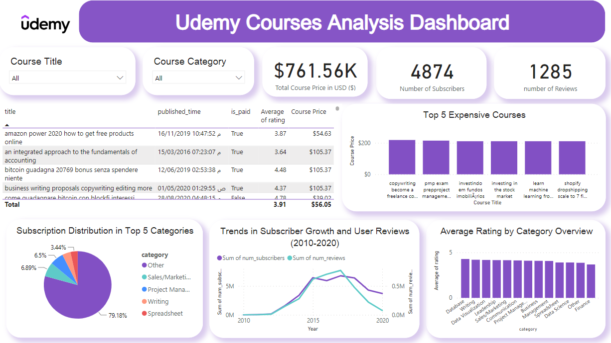

# 📊 Udemy Courses Analysis Project 📊

## Introduction
Welcome to the Udemy Courses Analysis Project repository! In this project, we explore the extensive range of courses available on Udemy to extract valuable insights and provide a comprehensive analysis. As online learning platforms like Udemy continue to expand, understanding the trends, patterns, and characteristics of courses becomes essential for guiding both learners and instructors. 📈

Explore the project presentation by clicking [Here](https://github.com/Abdoo50/Udemy-Financial-Courses-Analysis/blob/main/Udemy%20Financial%20Courses%20Analysis.pptx).

## Overview Dashboard

This project visualizes data to provide insights into how various countries have historically performed in terms of publishing courses on Udemy. As a data analyst at Udemy, I aim to address specific business questions through:

1. Cleaning data using a Kaggle notebook.
2. Conducting Exploratory Data Analysis (EDA) with Python.
3. Creating visualizations using Plotly and matplotlib.
4. Employing the Simple Imputer algorithm to predict missing values.
5. Importing processed data into Power BI.
6. Writing DAX formulas to derive specific measures.
7. Developing the final interactive dashboard in Power BI.

## Dataset
Access the dataset used in this project [Here](https://www.kaggle.com/datasets/jilkothari/finance-accounting-courses-udemy-13k-course).

## EDA and Data Cleaning
The data cleaning and exploratory analysis process includes:

- Dropping unnecessary columns.
- Replacing missing values.
- Removing duplicates.
- Employing the Simple Imputer algorithm for missing values prediction.
- Identifying and handling outliers.
- Addressing key performance indicators (KPIs).
- Visualizing data to uncover patterns and insights.
- Data wrangling for optimization.

View the detailed EDA notebook [Here](finance-courses-at-udemy-eda.ipynb).

## Usage
Download the final Power BI dashboard from [Here](https://github.com/sahermuhamed1/Udemy-Courses-Analysis-Project/blob/main/Udemy%20Dashboard.pbix).

## Contact Information
For inquiries or further collaborations, feel free to contact:

- **Abdelrahman Ashour:** [abdoashour4040@gmail.com](mailto:abdoashour4040@gmail.com) | [LinkedIn](https://www.linkedin.com/in/abdo-ashour-9467b623a/)
